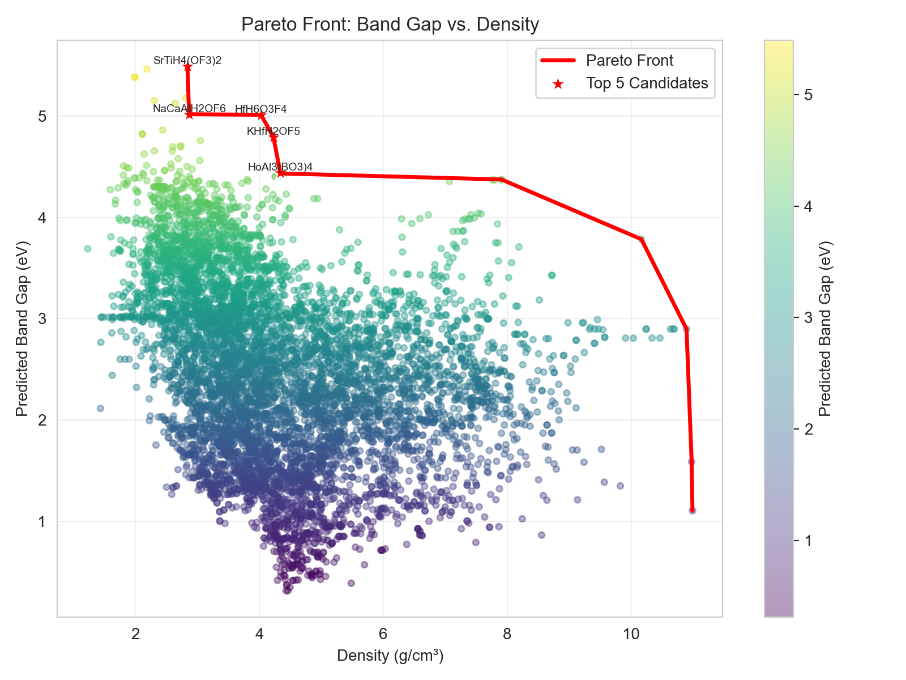

# Predicting Bandgaps of Heavy Metal Oxides for EUV Photoresists

**Scientific Question:** Can a composition-based Random Forest model predict the electronic bandgap of heavy metal oxides across different metal families using the Materials Project dataset?

## 📊 Dataset Source & Access
The dataset consists of 7,786 unique, thermodynamically stable heavy metal oxides (containing Sn, Hf, Zr, Ti, Al, Zn, or Ni).
* **Source:** Data is dynamically retrieved from the **Materials Project** database using the `mp-api` python client.
* **Citation:** Jain, A., Ong, S. P., Hautier, G., Chen, W., Richards, W. D., Dacek, S., Cholia, S., Skinner, D., Ceder, G., Persson, K. A. (2013). Commentary: The Materials Project: A materials genome approach to accelerating materials innovation. *APL Materials*, 1(1), 011002.
* **Access Instructions:** You need a free API key from the Materials Project. Register at [https://nextgen.materialsproject.org/api](https://nextgen.materialsproject.org/api) to obtain your key.

## 🛠️ Step-by-step Setup Instructions

To ensure reproducibility, please follow these setup steps on a clean machine:

**1. Clone the repository**
```bash
git clone [https://github.com/your-username/your-project-repo.git](https://github.com/your-username/your-project-repo.git)
cd your-project-repo
2. Set up the Conda environment
Create and activate the environment using the provided environment.yml file:

Bash
conda env create -f environment.yml
conda activate matds_env
3. Set up the Materials Project API Key securely
To run the data acquisition notebook, you must configure your API key locally.

Copy the provided .env.example file to a new file named .env.

Open the .env file and replace the placeholder with your actual API key:
MP_API_KEY="your_actual_api_key_here"
(Note: The .env file is included in .gitignore and will never be committed to Git).

🚀 How to Run the Notebooks
Execute the notebooks in the notebooks/ directory in the following exact order using Kernel → Restart & Run All:

01_data_acquisition.ipynb: Queries the MP API for heavy metal oxides, filters by stability and density, and saves the raw dataset.

02_eda_featurization.ipynb: Computes 132 MAGPIE features, handles EDA, and performs UMAP dimensionality reduction.

03_modeling.ipynb: Trains and cross-validates machine learning models (e.g., Random Forest vs Ridge).

04_results_visualization.ipynb: Generates cross-validated parity plots, pareto front analysis, and feature importance charts.

📈 Key Results
The Random Forest model trained on MAGPIE composition descriptors achieved a test-set MAE of 0.867 eV and an R² of 0.257 under rigorous cross-family GroupKFold validation.

While the model perfectly memorized the training data (Train R² = 0.965) and performed well within specific metal families (intra-family R² ~ 0.58–0.78), the severe performance drop during cross-family testing reveals a critical physical limitation: composition-only descriptors fundamentally fail to capture the distinct local coordination and crystal field effects governing different heavy metal cations.

Despite these limitations, a Pareto optimization approach successfully balanced high density (crucial for EUV absorption) and high bandgap. The top 5 optimal candidates identified by the model are:
* **HfH₂OF₅** (Density: 5.67 g/cm³, Predicted Bandgap: 6.21 eV)
* **KH₂OF₅** (Density: 2.85 g/cm³, Predicted Bandgap: 6.18 eV)
* **BaAlBO₃F₂** (Density: 4.29 g/cm³, Predicted Bandgap: 5.92 eV)


*Figure: Pareto front of predicted bandgap vs. density. The red markers highlight the top 5 candidates that offer the best trade-off between EUV absorption capability and wide electronic bandgaps.*
